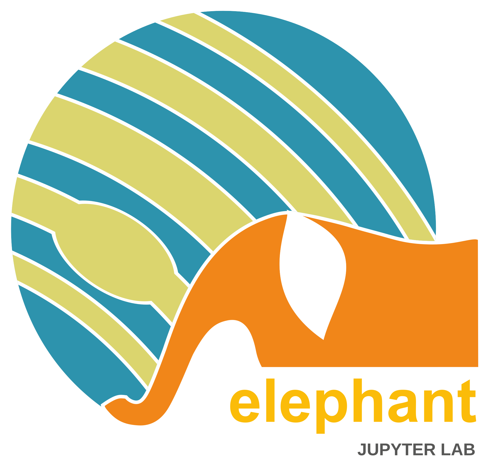

# Elephant Lab


***Explore, Visualize, and Analyze Electrophysiology Data - Right in JupyterLab***

Elephant Lab is a JupyterLab extension that brings interactive data exploration to your electrophysiology workflow. It reads datasets in any file format supported by [Neo](https://neo-python.readthedocs.io/) and displays them as an interactive object tree, so you can browse signals, spike trains, and events without writing a single line of code.

Select any object in the tree to inspect its metadata in the **Details panel** or explore it visually in the **Explore panel**. When you find something interesting, click **Insert Code** to get the selected object into your Notebook.

## Features

- **Interactive Neo object tree**: browse the full hierarchy of your dataset (Block → Segment → AnalogSignal, SpikeTrain, Event, ...)
- **Info panel**: inspect metadata and annotations for any selected object
- **Explore Panel**: visualize signals (time series), spike trains (raster, ISI, IFR), and events interactively using [Plotly](https://plotly.com/python/)
- **Multi-selection**: select several objects at once to compare them side by side
- **Overview plots**: rasterplot (SpikeTrains) and LFP overview (AnalogSignals)
- **Load button**: open any Neo-compatible file (`.nix`, Blackrock, ...) directly from the JupyterLab file browser
- **Insert Code button**: extract variables from the current selection and insert them into your notebook cell so they are ready to be analyzed 
- **Live kernel sync**: objects you create or modify in the notebook appear in the tree automatically

## Requirements

- Python >= 3.8
- JupyterLab >= 4.0
- [Neo](https://neo-python.readthedocs.io/): electrophysiology data model
- [Elephant](https://elephant.readthedocs.io/): electrophysiology analysis library
- [Plotly](https://plotly.com/python/): interactive visualizations
- [nixio](https://github.com/G-Node/nixpy): required for loading `.nix` files

All Python dependencies are installed automatically (see [Installation](#installation)).

## Installation

> **Note:** [Optional but recommended] Create a Python virtual environment using e.g. venv or conda.

Install Elephant Lab using `pip`:

```bash
pip install elephant-lab
```

To remove the extension:

```bash
pip uninstall elephant-lab
```

## Quick Start

1. Install Elephant Lab 
   ```bash 
   pip install elephant-lab
   ```
2. Launch JupyterLab:
   ```bash
   jupyter lab
   ```
3. Open the **Command Palette** (`View -> Active Command Palette` or `Ctrl+Shift+C`) and search for **Elephant Lab**. Click it to open the panel.
4. Click the **Load** button and select a Neo-compatible dataset (e.g. a `.nix` file).
5. Browse the object tree, click nodes to inspect them, and use **Insert Code** to use them in your Code.

For a step-by-step walkthrough, open the demo notebook:

```
examples/Elephant_Lab_Demo.ipynb
```

## Development Install

You will need [Node.js](https://nodejs.org/en/download) to build the extension.

```bash
# 1. Clone the repository
git clone git@github.com:INM-6/elephant-lab.git
cd elephant-lab

# 2. Create and activate a virtual environment
python3 -m venv .venv
source .venv/bin/activate   # on Windows: .venv\Scripts\activate

# 3. Install the package in development mode
pip install -e .

# 4. Link the extension with JupyterLab
jupyter labextension develop . --overwrite

# 5. Build the TypeScript source
jlpm build
```

For live reloading during development, run JupyterLab and the TypeScript watcher in two separate terminals:

```bash
# Terminal 1: watch and rebuild TypeScript automatically
jlpm watch

# Terminal 2: run JupyterLab
jupyter lab --watch --ServerApp.iopub_msg_rate_limit=1.0e7
```

Every saved change is rebuilt automatically; refresh the browser to load it.

### Development Uninstall

```bash
pip uninstall elephant-lab
```

You will also need to remove the symlink created by `jupyter labextension develop`. Run `jupyter labextension list` to find the `labextensions` folder, then delete the `elephant-lab` symlink inside it.

## Testing

End-to-end tests use [Playwright](https://playwright.dev/). See [ui-tests/README.md](./ui-tests/README.md) for details.

## Contributing

Do you have a question, suggestion, or found a bug? Please open an [issue](https://github.com/INM-6/elephant-lab/issues).

Would you like to fix a problem or add a feature? Please open a [pull request](https://github.com/INM-6/elephant-lab/pulls).


## Authors and Contributors

**Main authors:** [Tobias Michels](https://github.com/tomichels), [Jan Nolten](https://github.com/JanNolten), [Maximilian Kramer](https://github.com/ojoenlanuca), [Björn Müller](https://github.com/muellerbjoern)

**Contributors:** [Moritz Kern](https://github.com/Moritz-Alexander-Kern), [Michael Denker](https://github.com/mdenker)

## Acknowledgements

Elephant Lab builds on the [Neo](https://neo-python.readthedocs.io/) electrophysiology data framework and the [Elephant](https://elephant.readthedocs.io/) analysis library.

This project was developed at the [Institute for Advanced Simulation, Computational and Systems Neuroscience (IAS-6)](https://www.fz-juelich.de/en/inm/inm-6), Forschungszentrum Jülich.

This project was supported by the Ministry of Culture and Science of the State of North Rhine-Westphalia, Germany (NRW-network 'iBehave', grant number: NW21-049) and by the European Union's Horizon Europe Programme under the Specific Grant Agreement No. 101147319 (EBRAINS 2.0 Project).
